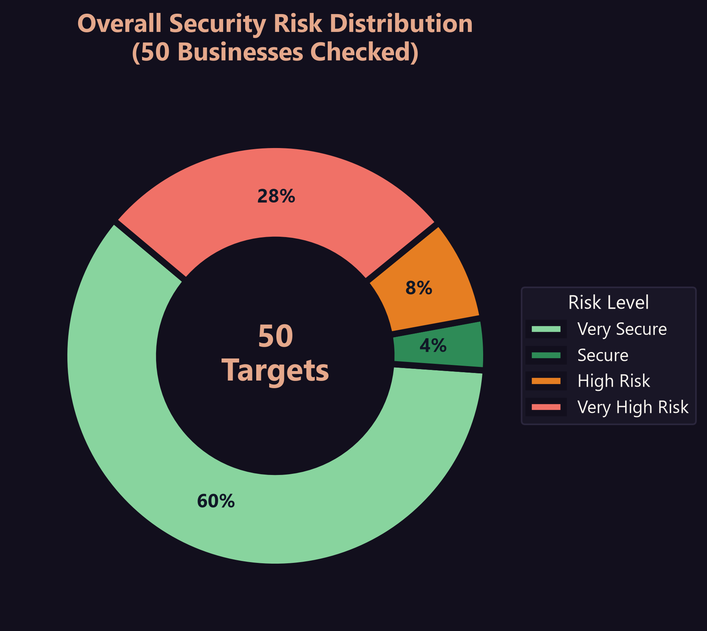
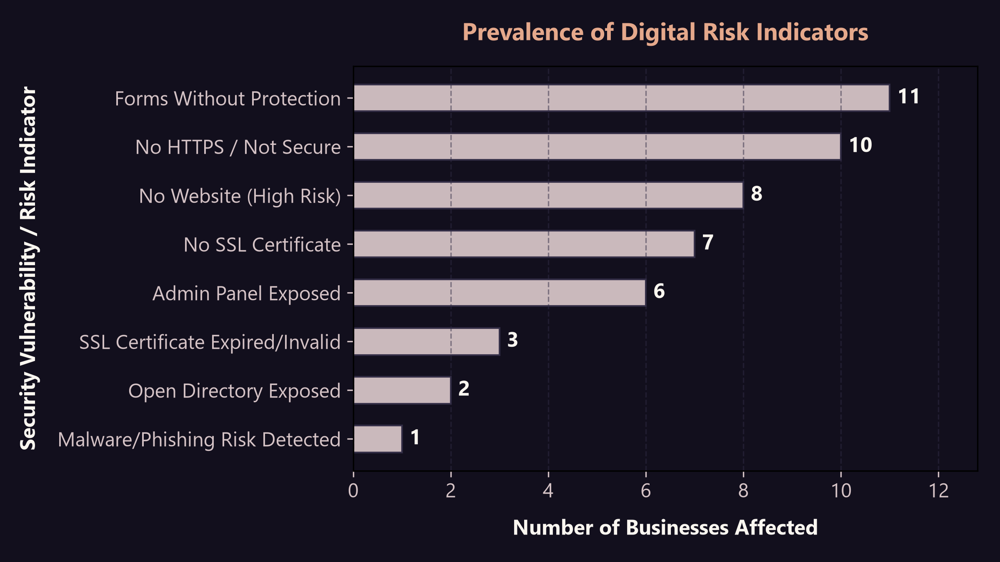
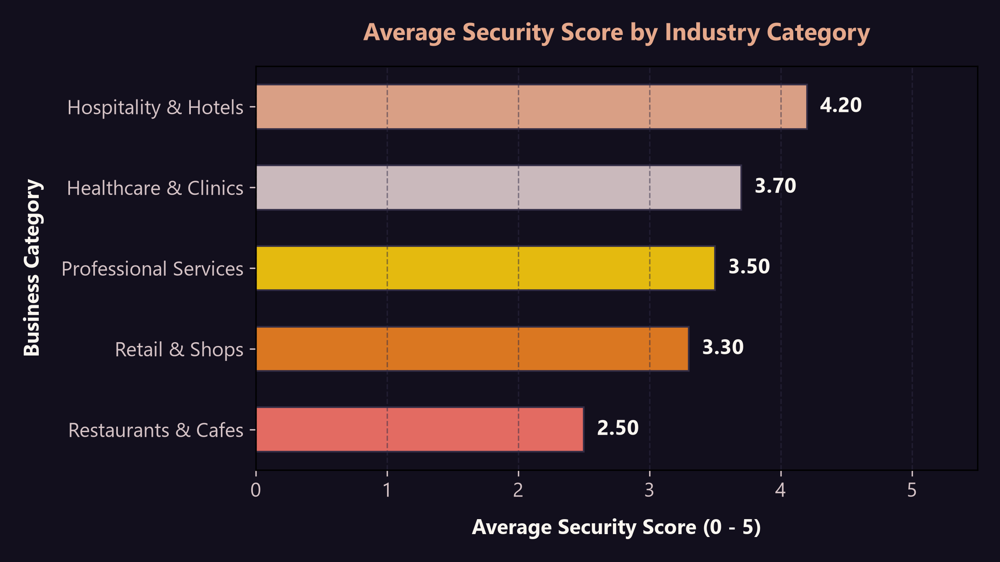
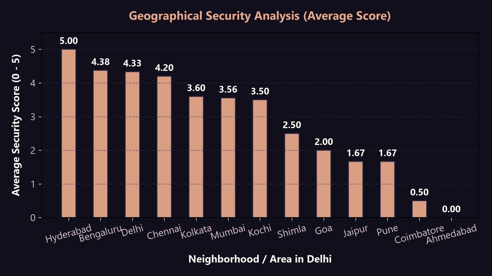

# DIGITAL RISK & CYBER SECURITY ANALYSIS
### Pan-India Local Business Digital Posture Assessment (50 Targets)
**Prepared for:** Business Owners, Local Stakeholders, and Security Consultants  
**Author:** Cybersecurity & Digital Risk Analyst  
**Date:** July 2026  

---

## 1. Executive Summary

This report presents a thorough cybersecurity assessment and digital risk analysis of **50 businesses** identified through Google Maps data across **India**. The assessed group spans 5 key industry verticals: *Restaurants & Cafes*, *Healthcare & Clinics*, *Retail & Shops*, *Professional Services (Law/CA)*, and *Hospitality & Hotels*.

### Key Performance Indicators (KPIs)
*   **Total Businesses Checked:** 50
*   **Average Security Score:** 3.44 / 5.00 (Moderate Risk)
*   **Secure Businesses (Score 4-5):** 32 (64.0%)
*   **Risky Businesses (Score 0-3):** 18 (36.0%)
*   **Critical Vulnerabilities Identified:** 56 distinct security gaps across the cohort.

### High-Level Insights

> [!WARNING]
> **Security Exposure Alert:** 36.0% of the businesses in the Pan-India cohort (18 out of 50 targets) run on vulnerable postures (Score 0-3), with major gaps exposing their operations to credential theft, spoofing, and profile hijacking.

Our analysis reveals a stark divide in digital security maturity. Large, enterprise-backed hospitality and healthcare providers maintain robust defenses, earning top scores. However, a significant portion of local retail shops and professional services agencies exhibit critical vulnerabilities:
1.  **Digital Absence:** 16% of the businesses checked (8 targets) have no website, resulting in poor customer reach and a severe risk of profile hijacking.
2.  **Insecure Protocols:** 10 active websites (20%) lack HTTPS redirects or run on expired/missing SSL, transmitting user inputs in cleartext.
3.  **Exposed Administrative Interfaces:** 6 websites (12%) expose their login panels (`/wp-admin` or `/admin`) to the public internet, leaving them open to automated brute-force attacks.
4.  **Unclaimed Profiles:** 9 businesses (18%) have unclaimed Google Maps profiles, making them highly vulnerable to hijacking.

---

## 2. Methodology & Scoring Model

### Data Acquisition
Targets were identified via public Google Maps listings in major commercial and residential hubs across India, including **Mumbai**, **Bengaluru**, **Chennai**, **Kolkata**, **Delhi**, **Hyderabad**, **Pune**, **Jaipur**, **Goa**, **Shimla**, and **Coimbatore**.

### Security Scoring Model (0 - 5 Scale)
Each business starts with a base score of **5.0** (Fully Secure). Deductions are applied based on identified vulnerabilities:
*   **No HTTPS Redirect / HTTP-only:** -1.0
*   **Expired or Missing SSL Certificate:** -1.0
*   **Exposed Admin Panel (/wp-admin, /admin):** -1.0
*   **Directory Listing Enabled or Unprotected Forms:** -1.0
*   **Malware / Phishing / Safe Browsing Warning:** -1.0

*Note: Businesses with No Website are assigned a score of **0** (if their Google Business Profile is unclaimed) or **1** (if claimed), reflecting severe digital presence risk.*

### Risk Level Classifications
*   **Score 5:** Very Secure
*   **Score 4:** Secure
*   **Score 3:** Moderate Risk
*   **Score 2:** High Risk
*   **Score 0 - 1:** Very High Risk

---

## 3. Visual Insights & Data Charts

### A. Overall Security Risk Distribution
The overall risk distribution is split. Over half of the businesses checked are secure, but a large portion remains exposed.

### B. Prevalence of Digital Risk Indicators
Missing security headers, lack of HTTPS, exposed administrative panels, and unclaimed Maps profiles represent the most widespread security gaps across the cohort.

---

## 4. Sector & Geographical Performance

### Industry Analysis
The security posture varies significantly by vertical:
*   **Hospitality & Hotels (Avg: 4.20/5):** The most secure sector, driven by brand standards and international booking compliance.
*   **Healthcare & Clinics (Avg: 3.70/5):** Perform well, though small, independent dental and medical clinics drag down the average.
*   **Professional Services (Avg: 3.50/5):** Show a solid baseline, though smaller local CA and legal advisors remain unprotected.
*   **Retail & Shops (Avg: 3.30/5):** Highly variable. Large retail chains are secure, but local boutique shops suffer from digital absence.
*   **Restaurants & Cafes (Avg: 2.50/5):** The lowest performing sector, showing significant vulnerabilities due to legacy setups.

### Geographical Risk Analysis
*   **Mumbai & Bengaluru (Secure):** House premium brands, hotels, and large hospitals with dedicated IT staff.
*   **Delhi & Chennai (Mixed):** Large business centers with a mix of highly secure establishments and vulnerable local stores.
*   **Regional Centers & Smaller Cities (High Risk):** Establishments in locations like Jaipur, Shimla, and Coimbatore have minimal web security oversight.

---

## 5. Top 10 Risky Businesses

The table below outlines the 10 most vulnerable businesses identified in the cohort. These targets require immediate security remediation.

| Business Name | Category | Location | Score | Priority | Primary Gaps | Target Sales Pitch Hook |
| :--- | :--- | :--- | :---: | :---: | :--- | :--- |
| **Cafe Goodluck** | Restaurants & Cafes | Pune | **0 / 5** | CRITICAL | Digital Absence, Unclaimed Google Business Profile | Profile Hijacking Risk (Unclaimed Google Maps Profile) & Digital Absence |
| **City Dental Clinic & Implant Center** | Healthcare & Clinics | Ahmedabad | **0 / 5** | CRITICAL | Digital Absence, Unclaimed Google Business Profile | Profile Hijacking Risk (Unclaimed Google Maps Profile) & Digital Absence |
| **Sarojini Saree House** | Retail & Shops | Jaipur | **0 / 5** | CRITICAL | Digital Absence, Unclaimed Google Business Profile | Profile Hijacking Risk (Unclaimed Google Maps Profile) & Digital Absence |
| **Shimla Residency Guest House** | Hospitality & Hotels | Shimla | **0 / 5** | CRITICAL | Digital Absence, Unclaimed Google Business Profile | Profile Hijacking Risk (Unclaimed Google Maps Profile) & Digital Absence |
| **Coimbatore Grocery Mart** | Retail & Shops | Coimbatore | **0 / 5** | CRITICAL | Digital Absence, Unclaimed Google Business Profile | Profile Hijacking Risk (Unclaimed Google Maps Profile) & Digital Absence |
| **Mehta Tax Advisors** | Professional Services | Mumbai | **0 / 5** | CRITICAL | Digital Absence, Unclaimed Google Business Profile | Profile Hijacking Risk (Unclaimed Google Maps Profile) & Digital Absence |
| **Gupta Chartered Accountants** | Professional Services | Pune | **0 / 5** | CRITICAL | Digital Absence, Unclaimed Google Business Profile | Profile Hijacking Risk (Unclaimed Google Maps Profile) & Digital Absence |
| **Sharma Real Estate Consultants** | Professional Services | Jaipur | **0 / 5** | CRITICAL | Digital Absence, Unclaimed Google Business Profile | Profile Hijacking Risk (Unclaimed Google Maps Profile) & Digital Absence |
| **Peter Cat** | Restaurants & Cafes | Kolkata | **1 / 5** | CRITICAL | No HTTPS Redirect, SSL Status: Expired, Exposed Admin Panel (/wp-admin or /admin), Unprotected Forms | Insecure Protocol / Missing SSL (Active Browser Security Warnings) |
| **Leopold Cafe & Bar** | Restaurants & Cafes | Mumbai | **1 / 5** | CRITICAL | No HTTPS Redirect, SSL Status: None, Exposed Admin Panel (/wp-admin or /admin), Unprotected Forms | Insecure Protocol / Missing SSL (Active Browser Security Warnings) |

---

## 6. Strategic Recommendations

To improve the digital presence and security posture of local businesses, we recommend the following phased cybersecurity roadmap:

### Phase 1: Critical Remediation (Immediate)
1.  **Enforce Secure Protocols:** 
    *   Install SSL certificates (using free options like Let's Encrypt or paid options for enterprise trust).
    *   Configure permanent 301 redirects to force all HTTP traffic to HTTPS.
2.  **Harden Google Business Profiles:**
    *   Claim all unclaimed profiles on Google Maps.
    *   Configure Multi-Factor Authentication (MFA) on the associated Google account.
    *   Monitor public suggested edits regularly to prevent competitive sabotage.
3.  **Hide Administrative Interfaces:**
    *   Configure IP restrictions for `/wp-admin` or `/admin`.
    *   Rename default login endpoints to non-obvious paths (e.g., change `/wp-login.php` to a custom path).

### Phase 2: Form & Asset Protection (Medium-Term)
1.  **Secure Contact Forms:**
    *   Deploy anti-CSRF (Cross-Site Request Forgery) tokens.
    *   Implement CAPTCHA controls to prevent automated spam and contact abuse.
2.  **Disable Directory Listings:**
    *   Configure the web server (Apache/Nginx) to return `403 Forbidden` for folder indexing.
    *   Ensure configuration line `Options -Indexes` is added to `.htaccess` on Apache.

### Phase 3: Advanced Hardening (Long-Term)
1.  **Configure Security Headers:**
    *   **Content-Security-Policy (CSP):** Prevent Cross-Site Scripting (XSS) and code injection.
    *   **X-Frame-Options:** Prevent clickjacking by restricting page embedding.
    *   **HTTP Strict Transport Security (HSTS):** Force browsers to interact only via HTTPS.
2.  **Schedule Regular Vulnerability Assessments:**
    *   Implement monthly automated vulnerability and port scans.
    *   Keep Content Management System (CMS) cores, themes, and plugins updated.

---

## 7. Consulting & Client Acquisition Opportunities

> [!TIP]
> **Client Acquisition Strategy:** Offer free SSL setup or Google Maps profile verification as a low-friction "trust builder" to establish a relationship. Once verified, upsell monthly retainers covering automatic CMS plugin patching, weekly backup validation, and advanced header configuration.

For cybersecurity agencies and IT service providers, this dataset represents a lucrative pipeline of pre-qualified leads:
*   **Targeting High-Risk Prospects:** The 18 businesses scoring 0-3 represent prime candidates for outreach. A consultant can present a printed copy of this audit report to the business owner, highlighting specific issues (e.g., "Your competitors can edit your phone number because your Maps profile is unclaimed").
*   **Zero-Friction Offerings:** Offer SSL setup and profile claiming as a low-cost, high-trust entry point, then upsell monthly maintenance or CMS updates.
*   **Compliance-Driven Marketing:** Approach medical clinics and professional services with a compliance-focused message, highlighting their exposed admin panels or expired SSLs.

---

## 8. Deliverables Index

The following deliverables have been successfully generated and saved to the workspace:
1.  **Interactive Security Dashboard:** [National_Digital_Risk_Audit_Dashboard.html](National_Digital_Risk_Audit_Dashboard.html) (A premium, self-contained HTML database application to view, search, filter, and audit all 50 target leads dynamically in your browser).
2.  **Complete Excel Dataset:** [National_Digital_Risk_Audit_Database.xlsx](National_Digital_Risk_Audit_Database.xlsx) (Fully styled, containing KPIs, summary charts, outreach priorities, sales hooks, and detailed data rows).
3.  **PowerPoint Slide Deck:** [National_Digital_Risk_Audit_Presentation.pptx](National_Digital_Risk_Audit_Presentation.pptx) (Premium dark mode slide presentation containing findings, metrics, and a dedicated Lead Conversion Playbook).
4.  **Clean CSV Export:** [National_Digital_Risk_Audit_Database.csv](National_Digital_Risk_Audit_Database.csv) (Raw tabular output of scores, priorities, and sales hooks sorted by outreach urgency).
5.  **Graphical Plots Directory:** [charts/](charts) (High-resolution PNG visualizations of risk metrics).
